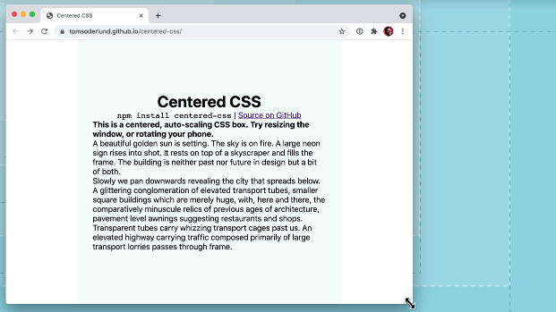

# Centered CSS framework

**A centered, auto-scaling CSS box**

NPM: https://www.npmjs.com/package/centered-css

Demo: https://tomsoderlund.github.io/centered-css/

## Installation and usage

    npm install centered-css

Add class `centered-container` on an element, and `centered` on the child element that you want centered ([demo](https://tomsoderlund.github.io/centered-css/index.html)).

Class `centered portrait` will make it in portrait aspect ratio, more suitable for phones ([demo](https://tomsoderlund.github.io/centered-css/portrait.html)).

Then, use `em` or `%` size units (not `px` or `rem`) and **the content will auto-scale with the window size**.

### Import in JavaScript

    import 'centered-css/dist/centered.min.css'

Optional: Add this for iOS Safari resize fix:

    

or for React:

    useLayoutEffect(() => {
      // iOS Safari resize fix in React
      function handleResize () {
        // For 'portrait': window.document.documentElement.style.setProperty('--vh', `${window.innerHeight * 0.01}px`);
        window.document.documentElement.style.setProperty('--vmin', `${Math.min(window.innerWidth, window.innerHeight) * 0.01}px`);
      };
      window.addEventListener('resize', handleResize);
      handleResize();
      return () => window.removeEventListener('resize', handleResize);
    }, []);

## Update NPM

    yarn publish

(Will run `yarn prepare` automatically, which builds the `/dist` folder)
